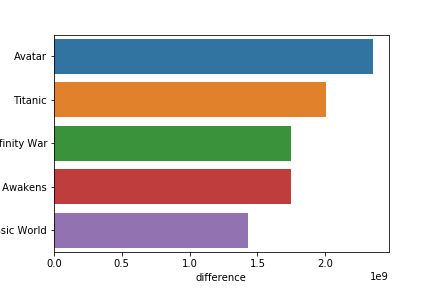

# Project Description:

Analyzing movie data to come up with recommendations for Microsoft's new business venture

## Data

Data comes from 3 different sources:

* IMDb
* Rotten tomatoes
* Box Office Mojo

**Data can be found in the zippedData folder**

## Key Findings

### Is there a best time to release the movie?

Here I tried to analyze whether there is a preferable time to release a movie. We looked at the worldwide gross of films released during all the months of the year. We also looked at the mean profit. The data came from **bom_movie_gross.csv** file. We had to perform some cleaning on the data. We dropped all the missing values. We also converted the datatypes of these columns.

Here are our key findings:
1. Best time to release a film seems to be June based on the profit made.
2. But, the average rating seems to be the highest around December.

**Recommendations**

1. If you are more interested in critical acclaim, release the movie towards the end of the year.
2. If you are looking to make a profitable film, it will be better to release it in the summer months.

